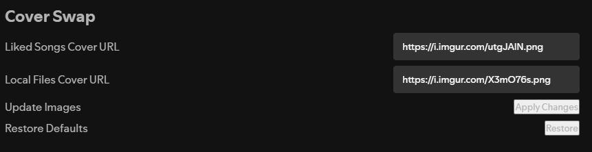

<p align="center">
 

 <h1 align="center">
    <a href="https://github.com/Astoric/cover-swap" style="text-decoration: none;">Cover Swap</a>
 </h1>
</p>

This Spicetify Extension allows you to change the covers on default playlists, such as Liked Songs or Local Files.

⭐ If you enjoy this extension, please make sure to give it a star to help it get noticed!

## Dependencies
[`Spicetify`](https://spicetify.app/docs/advanced-usage/installation) - To use this extension, please install Spicetify by following the instructions in the documentation.


## Manual installation
1. Download [`cover-swap.js`](https://github.com/Astoric/cover-swap/blob/main/dist/cover-swap.js) file from this repository and place it in the following directory:

| Platform      | Path                             |
| ------------- |:--------------------------------:|
| Windows       | `%appdata%\spicetify\Extensions` |
| Linux/MacOS	| `~/.config/spicetify/Extensions` |

2. Activate the extension using the following powershell commands
```console
$ spicetify config extensions cover-swap.js
$ spicetify apply
```

## Uninstall
1. Disable the extension using the following commands
```console
$ spicetify config extensions cover-swap.js-
$ spicetify apply
```

2. Delete the file from step #1 in the installation instructions. (Optional)

## Usage

1. To update the Default Playlist covers, first navigate to settings and scroll to the bottom.


2. Paste the desired cover URL into the desired box. (Note; Please ensure you're pasting the raw image URL, ending in .png, .jpeg etc.)

3. Hit Update Images! This will update the desired image across the board.

4. (Optional) If you wish to restore the default images, just hit the Restore Defaults button.

## Credits
Thanks to the [`Spicetify Team`](https://github.com/spicetify/). `Cover Swap` was creating using the Spicetify Creator.